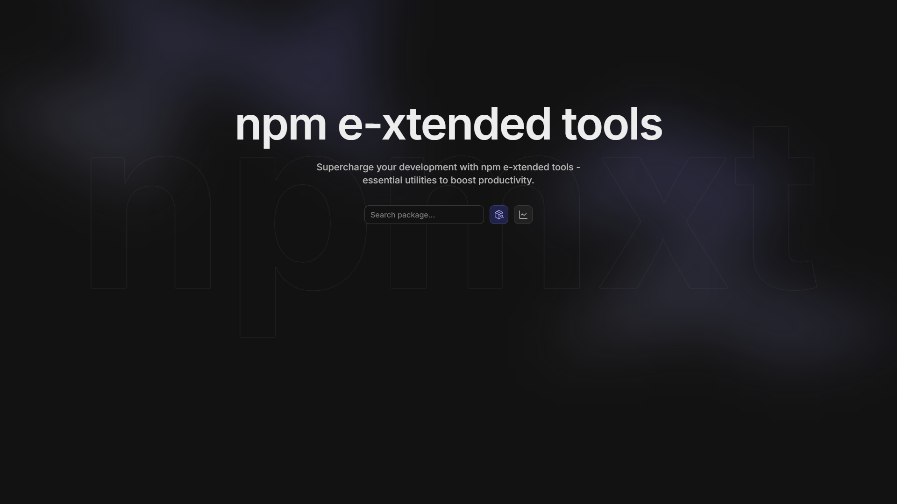

<h1 align="center">
  npmxt
</h1>

  npm e-xtended tools

Supercharge your development with npm e-xtended tools - essential utilities to boost productivity.

Project built with [SolidStart](https://start.solidjs.com) for [SolidHack2024](https://hack.solidjs.com).

## Roadmap

- Browse code
- Packages comparison
- Packages bundle size
- And more...

## Credit

- [npmjs.com](https://www.npmjs.com) - for the primary NPM API
- [bundlejs.com](https://bundlejs.com) - for the bundle size API

## License

[MIT](./LICENSE)
